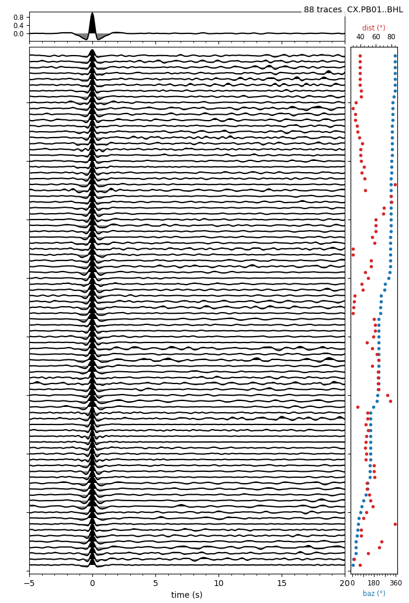
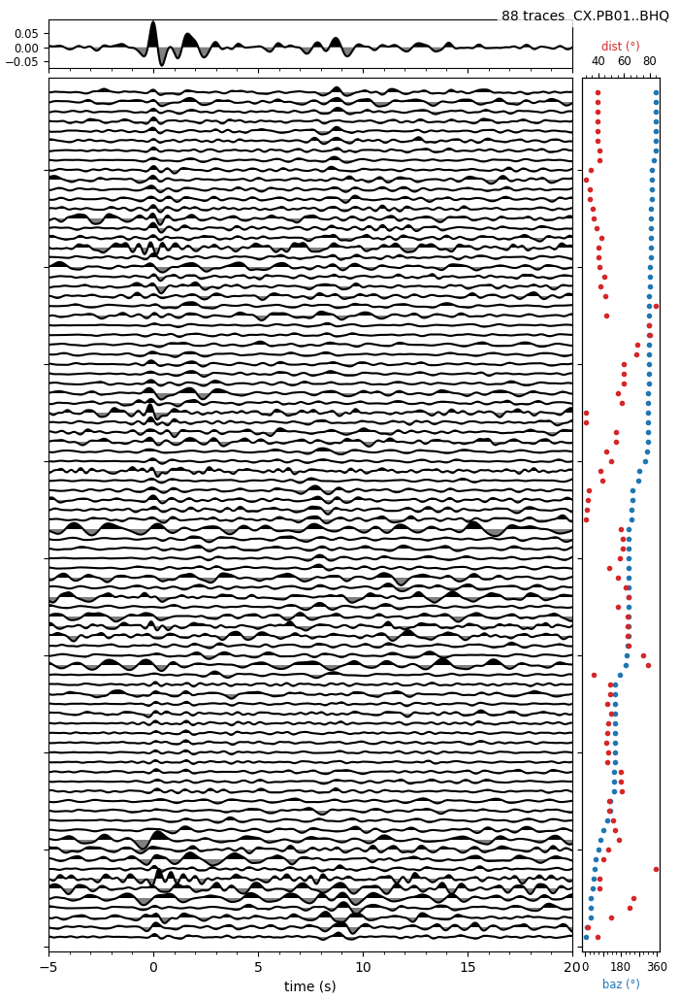
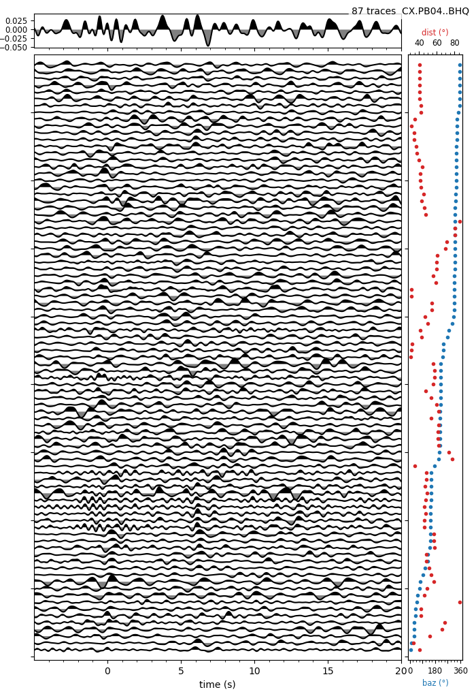
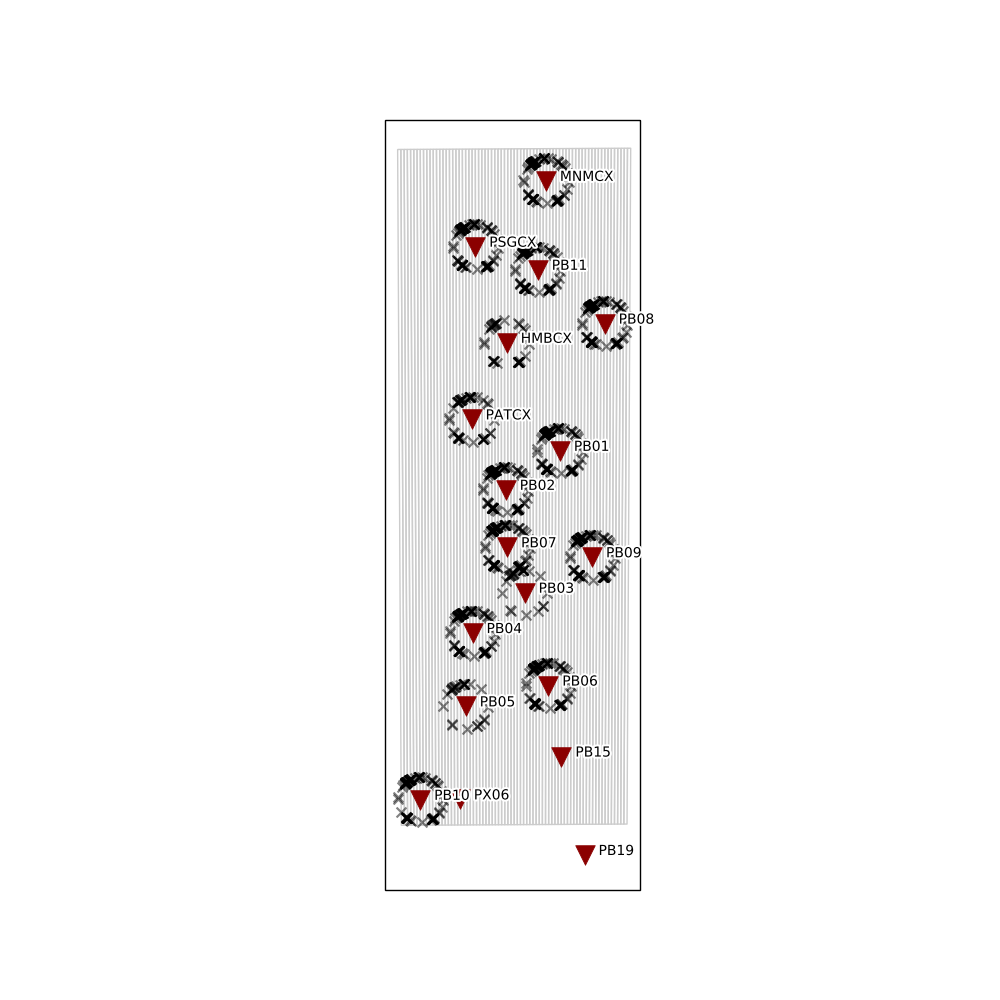
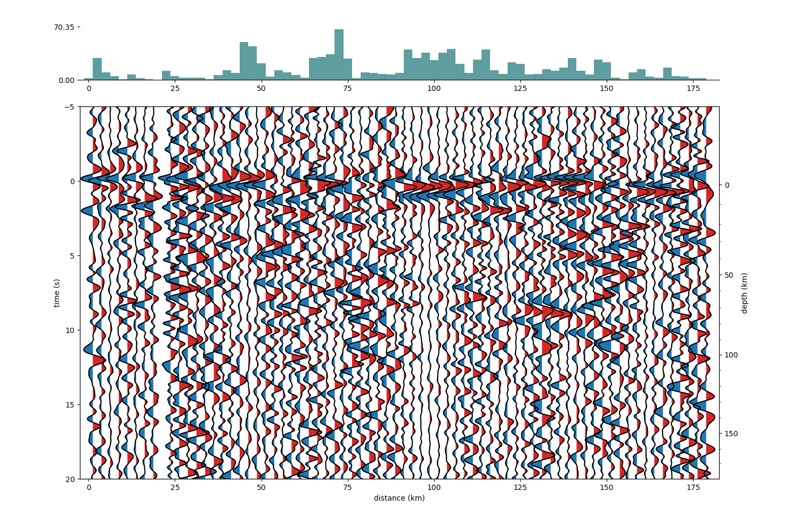

# Receiver Function Recalculation

Recalculation of the results from [West-East receiver function profile in Northern Chile](https://nbviewer.jupyter.org/github/trichter/notebooks/blob/master/receiver_function_profile_chile.ipynb).

## Installation:
If you have anaconda available then all the package can be installed using the command:

`conda env create -f environment.yml`

## Requirements:
If you wanna install separately:
- toeplitz (time domain deconvolution)
- ObsPy and some of its dependencies
- obspyh5 for hdf5 file support

Check [here](https://rf.readthedocs.io/en/latest/) for full documentation.

## Results:

### Receiver function results

  

  

  

### Receiver function profile map

  

### Receiver function profile

  

